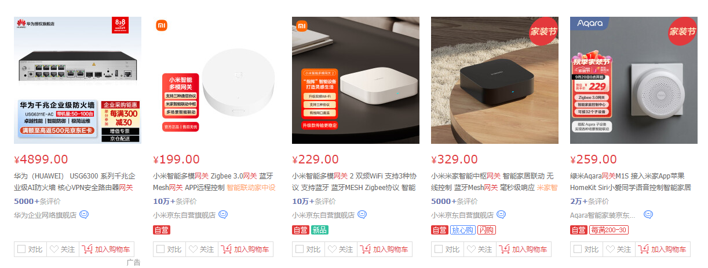

# Gateway 是什么？

## Gateway 定义是什么？

百度百科解释：

网关(Gateway)又称网间连接器、协议转换器。网关在网络层以上实现网络互连，是复杂的网络互连设备，仅用于两个高层协议不同的网络互连。网关既可以用于广域网互连，也可以用于局域网互连。 网关是一种充当转换重任的计算机系统或设备。使用在不同的通信协议、数据格式或语言，甚至体系结构完全不同的两种系统之间，网关是一个翻译器。与网桥只是简单地传达信息不同，网关对收到的信息要重新打包，以适应目的系统的需求。同层--应用层。

在it技术领域，网关最初是一种硬件设备的代名词，时至今日，在购物网站上搜索“网关”依然可以看见大量硬件设备

<figure><figcaption></figcaption></figure>

其中路由器就是大家接触最多的网关设备，这些设备通常主要负责数据转发的角色。

换句话说，这些设备就像快递公司一样负责收发数据，而我们像在微信上交流就必须把我们的数据打包成快递让网关送到其他人那里。

而在软件领域，网关软件大多主要解决以下问题：

1.  设备成本

    互联网不断发展，我们有各种各样需求需要针对性转发各种数据

    * 比如早年博客盛行的时代，自己搭建博客是技术宅的必备选择，如果都需要一个硬件设备，电费网费设备费估计没多少人能承受
    * 直播、短视频盛行的现在，如此量级庞大并且种类繁多的数据流如果仅仅通过硬件设备分类，定位以及转发，几亿人的视频如何配额呢？
2.  定制化能力

    现代需求越来越复杂，硬件由于难以修改，很难针对性添加业务处理，比如

    * 大家常常遇见攻击之后，想限制某个ip访问量
    * 站点访问量暴增，需要添加新的服务器，像微博上明星出轨离婚那个夸张访问量
    * 微服务拆分
    * 灰度上线
    * 等等

由 nginx 、envoy 再到 apisix 、kong、istio 等等，复杂度与其涵盖的知识面，是笨鸟本人多年都不曾学完。

